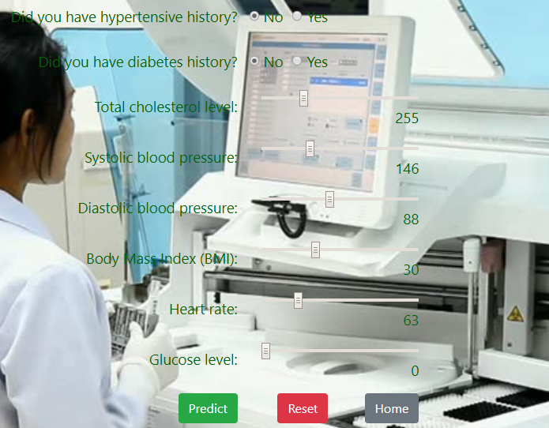

# Purwadhika Job Connector Data Science Final Project
## Heart Disease Prediction Web App

This repository contain my final project in [Purwadhika](https://purwadhika.com/jc-data-science) Job Connector - Data Science Program. 

Using heart disease dataset from [kaggle.com](https://www.kaggle.com/amanajmera1/framingham-heart-study-dataset), I compare 4 Machine Learning model: 

1. Logistic Regression
2. Random Forest
3. K - Nearest Neighbors 
4. Support Vector Machine

to predict from the given condition if the person has a risk of coronary heart disease in the next ten years or not.

Features those I used to make predictions are:
* currentSmoker: whether or not the patient is current smoker 
* cigsPerDay: the number of cigarettes that the person smoked on average in one day
* BPMeds: whether or not the patient was on blood pressure medication
* prevalentStroke: whether or not the patient had previously had a stroke
* prevalentHyp: whether or not the patient was hypertensive
* diabetes: whether or not the patient had diabetes 
* totChol: total cholesterol level
* sysBP: systolic blood pressure
* diaBP: diastolic blood pressure
* BMI: Body Mass Index
* heartRate: heart rate
* glucose: glucose level

Complete step by step process can be seen in [notebook](notebook).

After that, I embed the machine learning model into a web app that I build using Flask framework. You can clone this repo and see how the app work by running file [app.py](app.py). I use MongoDB to store the username and password. If you don't have access to MongoDB, you can still play around using [json](dataset/database.json) data that I have already generated. 

These are the screenshot of my web app:

1. Existing user can log in via home page.

2. If user don't have an account they can create one via sign up page.

3. User is directed to prediction page where they can input their health condition.

4. Result page shows the prediction result and user attributes in distribution of existing dataset.

5. Finally I store user condition and prediction result in MySQL database.

Hope you like this page and it will be useful for your learning.

😊😊👊👊
___

Reach me out at:
[Linkedin](https://www.linkedin.com/in/nickodemus-richard-rinaldi/)